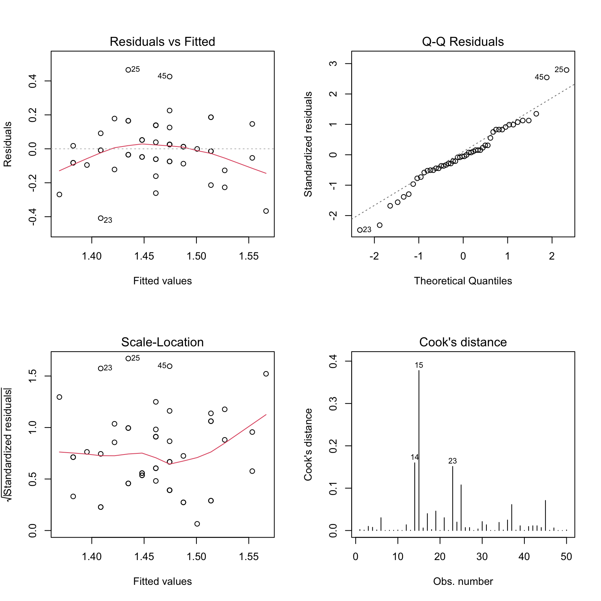
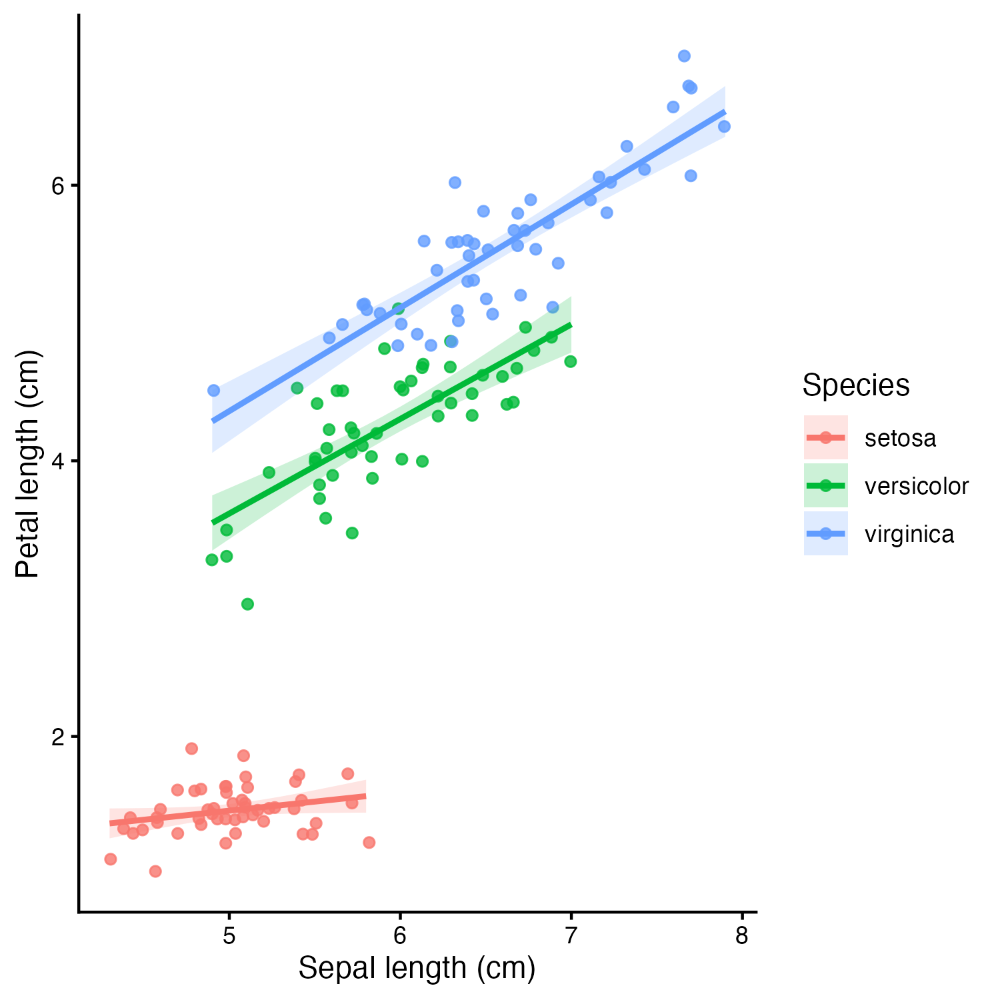
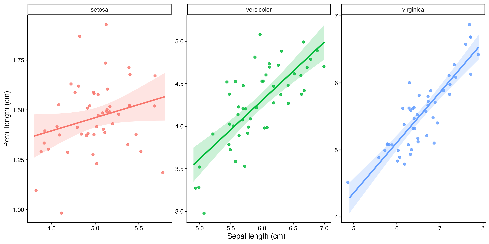

<!-- Script for Copy Button -->

```{=html}
<script>
document.addEventListener('DOMContentLoaded', () => {
  document.querySelectorAll('pre').forEach((block, i) => {
    const button = document.createElement('button');
    button.innerText = 'Copy';
    button.className = 'copy-btn';

    button.onclick = () => {
      navigator.clipboard.writeText(block.innerText)
        .then(() => {
          // change text to "Copied!"
          const original = button.innerText;
          button.innerText = 'Copied!';
          button.style.backgroundColor = '#4d7b85';

          // revert after 1.5s
          setTimeout(() => {
            button.innerText = original;
            button.style.backgroundColor = '';
          }, 1500);
        })
        .catch(err => console.error("Failed to copy: ", err));
    };

    // attach button
    block.style.position = 'relative';
    block.appendChild(button);
  });
});
</script>
```

<!-- CSS Styling -->

```{=html}
<style>
body {
  font-family: sans-serif;
  margin: 0;
  padding: 0 20px;
}

/* Horizontal menu bar */
.navbar {
  display: flex;
  justify-content: center;
  background-color: #FFFFFF;
  padding: 10px 0;
  margin-bottom: 10px;
  font-weight: plain;
}

.navbar a {
  color: #0077cc;
  transition: color 0.2s;
}

.navbar a:hover {
  color: #005999;
}

/* Header image */
.top-banner {
  width: 100%;
  height: 250px;
  background-image: url('asset/header.jpg'); /* adjust path */
  background-size: cover;
  background-position: center;
  display: flex;
  flex-direction: column;
  justify-content: center;
  padding-left: 40px;
  color: white;
  text-shadow: 0 0 5px rgba(0,0,0,0.7);
  box-sizing: border-box;
  border-radius: 6px;
}

.top-banner h1 {
  margin: 0 0 10px 0;
  font-size: 3em;
}

.top-banner h3 {
  margin: 0;
  font-weight: 300;
}

/* Callouts */
.callout {
  border-left: 5px solid #669ea0;
  background-color: #f0f8f8;
  padding: 10px 15px;
  margin: 20px 0;
  border-radius: 4px;
}

/* Code block styling */
pre {
  background-color: #f7f7f7;
  padding: 10px;
  border-radius: 5px;
  overflow-x: auto;
  font-family: monospace;
  position: relative;
}

/* Syntax-only code blocks */
pre.syntax {
  background-color: #f7f7f7 !important;
  padding: 10px;
  border-radius: 0px;
  box-shadow: none !important;
  border: none !important;
  position: static;  /* prevents the copy button from attaching */
}

/* Ensure no copy button appears on syntax blocks */
pre.syntax .copy-btn {
  display: none !important;
}

/* Copy button */
.copy-btn {
  position: absolute;
  top: 5px;
  right: 5px;
  font-size: 0.8em;
  padding: 2px 6px;
  cursor: pointer;
  background-color: #669ea0;
  color: white;
  border: none;
  border-radius: 3px;
  transition: background-color 0.2s;
}

.copy-btn:hover {
  background-color: #4d7b85;
}


/* Footer */
footer {
  text-align: center;
  padding: 15px 0;
  margin-top: 40px;
  border-top: 1px solid #ddd;
  background-color: gray;
  font-size: 0.9em;
  color: white;
  display: flex;
  justify-content: center;
  align-items: center;
  gap: 8px;
}
footer a {
  display: inline-flex;
  align-items: center;
  gap: 5px;
  text-decoration: none;
  color: white;
}

/* Capture button */
details {
  border-left: 0px solid #669ea0;
  background-color: #f0f8f8;
  padding: 10px 15px;
  margin: 10px 0;
  border-radius: 4px;
}

summary {
  font-weight: bold;
  cursor: pointer;
  outline: none;
}

.revise-box {
  background-color: transparent;   /* no background */
  border-left: 0;                   /* optional: remove border */
  padding: 0;                       /* optional: remove padding */
  margin: 10px 0;
}


/* All links color */
a {
  color: #669ea0;     
  transition: color 0.2s;    
}

a:hover {
  color: #4d7b85;     
}
</style>
```

</head>

<body>

<!-- Horizontal Menu -->

::: navbar
<a href="#tutorial-aims" style="color: #669ea0; margin-right: 100px;">Tutorial Aims & Content</a> <a href="#challenge" style="color: #669ea0; margin-right: 100px;">Challenge</a> <a href="#resources" style="color: #669ea0; margin-right: 100px;">Useful Resources</a> <a href="#contact" style="color: #669ea0">Contact</a>
:::

<!-- Header Image -->

::: top-banner
<h1>Working with a Nested Data Set</h1>

<h3>Build Multiple Linear Models using <code>purrr</code></h3>
:::

<!-- Author & Date -->

<br /> *Author: B241110* <br> *Date: 25th November 2025*

<details class="who-for">

<summary>**Who this tutorial is for**</summary>

This tutorial is designed for learners who have completed the [Coding Club](https://ourcodingclub.github.io/) courses [**STATS FROM SCRATCH**](https://ourcodingclub.github.io/course/stats-scratch/index.html) and [**WIZ OF DATA VIS**](https://ourcodingclub.github.io/course/wiz-viz/index.html).

If you are new to the Coding Club, we expect that you are familiar with at least

-   [data manipulation in `tidyverse` using pipe (`%>%`)](https://ourcodingclub.github.io/tutorials/data-manip-efficient/index.html),
-   the basics of [data visualisation using `ggplot2` package](https://ourcodingclub.github.io/tutorials/datavis/index.html), and
-   [theory and application of linear models in R](https://ourcodingclub.github.io/tutorials/modelling/)

Advanced learners who are familiar with `apply()` family and `for()` loop iterations are also welcome.
</details>

<hr>

### Tutorial Aims: {#tutorial-aims}

1.  [What is a Nested data set?](#1-what-is-nest)
2.  [Building Models in a Nest](#2-linear-model-with-nest)
3.  [Tidy Model Outputs for Reproducibility](#3-tidy-outputs)
4.  [Generate Multiple Plots in One-Go & Save](#4-visualise-save)

<br /> By now, you've learnt how to load data, tidy them, build and interpret linear models to test hypotheses. These are strong quantitative skills that let you navigate many ecological and environmental questions.

But what happens when you have multiple sites or species, and you want an independent model for each group?  
It’s easy to imagine situations where the number of sites, species, or treatments is far more than just a few, especially in global studies or long-term data sets. Manually creating a model for each group becomes quickly impractical.

Fortunately, there are much more efficient ways to handle this.

In this tutorial, we’ll learn **how to build many linear models at once across subsets of data** using **a nested data structure**. We’ll also cover how to automatically generate plots for each model and how to combine all results into a single, tidy summary for interpretation.  
We will leverage iterative tools from the `purrr` package, part of the tidyverse, to streamline these tasks.


::: callout
<strong>Note:</strong>\
The tutorial acts as **a working example of a linear model workflow using `purrr` in a nested data set**.    
For more comprehensive guide to all `purrr` functions, see resources such as [Rebecca's tutorial](https://rebeccabarter.com/blog/2019-08-19_purrr). 

:::


To begin, open a new `R Script` in `Rstudio`, where you will write the code for this tutorial. Set the folder your R Script is in as your working directory by running the code below (replacing `path_to_folder` with the location of your working directory):

``` r
# set working directory
setwd(path_to_folder) 
```

<a name="section1"></a>

## 1. What is a Nested data set? {#1-what-is-nest}

A nested data set is a **data frame where each row contains another data frame inside it**. In other words, you can take many small related data frames and store each of them in a single column as *list* elements.

Remember list?  
**List** is a data structure that can contain multiple items of different data types such as **numbers, characters, functions, vectors, and a data frame**.

The nested structure is "**hierarchical**":

-   The "outer" data frame contains your groups (e.g., species, sites, treatments) you are interested in
-   The "inner" data frames contain all the observations belonging to each group.

To get this data structure, we need to **nest** our data.  
Nesting can be done using `tidyr` package included in `tidyverse` package. Let's create our first nested data frame.

First, load the data and take a quick look:
``` r
data(iris) # load data 
View(data) # glimpse into data 
```

We will use R built-in **iris** data set for this tutorial.  
You can see that there are 150 observations of **3 species** (*setosa, versicolor*, and *virginica*) belonging to genus *Iris*, each containing petal length, sepal length, petal width, and sepal width.

Now load the tidyverse and nest the data by species:

``` r
## install.packages(tidyverse) # install tidyverse packages if you haven't
library(tidyverse)

iris_nested <- iris %>% 
    group_by(Species) %>% # group by species 
    nest() # nest by species 
View(iris_nested) 
```

You should see something like below:

|     | Species    | data                     |
|:----|:-----------|:-------------------------|
| 1   | setosa     | *\<data.frame[50 x 4]\>* |
| 2   | versicolor | *\<data.frame[50 x 4]\>* |
| 3   | virginica  | *\<data.frame[50 x 4]\>* |

The `data` is now a **list** column containing one data frame per species.

<br />

#### Calling elements in a nested data frame {#call-elements}

So how does the each data frame look like? To access an element (`data.frame`) in a list column (`data`), you need double brackets.

``` r
View(iris_nested$data[[1]]) 
```

Here, you are accessing the first list (Species setosa)'s petal width, length, and sepal width and length.

Another way you can locate your data frame for a specific group (species) is by using base R indexing, or using a `purrr:pluck` function (part of `tidyverse` collection).

Try:

``` r
View(iris_nested[[2]][[1]]) # base R 
View(pluck(iris_nested, 2, 1)) # pluck 
```

Inherently it is doing the same thing. Here, the number `2` refers to the second column of the outer data frame (`iris_nested`), which is the `data` column containing the nested data frames. The second `[[1]]` then selects the first element (data frame) within that column.  

You should see something like below, much like the original data frame but without a column specifying species.  

| Sepal.Length | Sepal.Width | Petal.Length | Petal.Width |
|:-------------|:------------|:-------------|:------------|
| 5.1          | 3.5         | 1.4          | 0.2         |
| 2            | 4.9         | 3.0          | 1.4         |
| 0.2          | 3           | 4.7          | 3.2         |
| ...          | ...         | ...          | ...         |

<a name="section2"></a>

## 2. Build Models in a Nest {#2-linear-model-with-nest}

In this data set, we are interested in modelling how petal length is explained by the length of sepal.  
We want to build a model per species.

Conventionally, we can do something like this.

``` r {.syntax}
# build linear model for each species using lm()
lm_setosa <- lm(Petal.Length ~ Sepal.Length, data = iris[iris$Species=="setosa", ])
lm_versicolor <- lm(Petal.Length ~ Sepal.Length, data = iris[iris$Species=="versicolor", ])
lm_virginica <- lm(Petal.Length ~ Sepal.Length, data = iris[iris$Species=="virginica", ])
```

3 models seem ok in terms of repetition, but this can be lengthy when the length of group you are interested in are more than 10s or 100s.

In such case, the nested data frame comes in handy.

We can use `map()` function from `purrr` package to build linear models to all species at once.

The basic syntax of `map()` looks as below:

``` r {.syntax}
map(input_data, function) 
```
Where `input_data` is the list of data frames to which the function will be applied to, and the `function` is a particular operation that you want to pass to `input_data`.  
To tell R that you are writing a function, you use `function()` and then the commands that you want your function to include go between the curly brackets (`{}`).

For our case, we build a linear model function: 
```r 
# Pre-define a function that constructs a linear model 
iris_lm <- function(df) { 
  lm(Petal.Length ~ Sepal.Length, data = df)
  }
``` 
Here, `df` is the input data frame (data frame in a *list* column).  

We want to construct and store linear models in the same "outer" data frame.  
The tidiest way is to create a new column in an `iris_nested` data frame that stores the linear model: 
```r 
iris_nested <- iris_nested %>% 
  mutate(model = map(data, iris_lm)) # build model and mutate it as a new column in iris_nested 

View(iris_nested) 
``` 
We are using `mutate()` to create a new column called `model` in `iris_nested`, which is a function of `iris_lm` we just defined, where `iris_nested$data` is the input list. `map()` is going to iterate over all elements and return outputs as a list column `data`.  

If you view `iris_nested` now, you will see a new column named `model` (as below). What you are seeing in this column is a new list with each element containing a full model object (usually a list created by `lm()`). 

|  | Species | data | **model** |
|:-|:-----|:--------|:------------------|
| 1          | setosa         | *<data.frame[50 x 4]>*          | *c(coefficients = "0.8030518, 0.1316317", residuals [...]* |
| 2            | versicolor       | *<data.frame[50 x 4]>*          | *c(coefficients = "0.1851155, 0.6864698", residuals [...]*        |
| 3         | virginica           | *<data.frame[50 x 4]>*          | *c(coefficients = "0.6104680, 0.7500808", residuals [...]*         |

#### Glance at Summary

To have a quick summary of the model, we call for the element of the list column `model`. How do we do this? 

Write your own code here to print the summary of a model for species *setosa*.  
(HINT: calling for an element in a list, covered at the [end of Part.1](#call-elements)) 

<details>

<summary><strong>Check Answer</strong></summary>

``` r
summary(iris_nested$model[[1]]) # call for a summary of the model of species: setosa
```

</details>

If successful, you can find a summary of model in R console including residuals, coefficients, various statistical values such as R-squared and *p*-value, as with the usual linear model.  
You can do the same for the second and third species versicolor and virginica. 


<a name="section3"></a>

## 3. Tidy Model Outputs for Reproducibility {#3-tidy-outputs}

The standard practice right after you build a model is to check the model fit (how much variance the model explains, i.e., the R-squared, Residual mean squared, and *p*-value). You can do so in the `summary()` method I mentioned in [part.2](#2-linear-model-with-nest). but, this can get repetitive when you have many models.  
We are thinking higher level in terms of reproducibility and reporting all model outputs at once. We want to easily compare the model fit across species. 

We will use `glance()` from `broom` package to get the tidier model outputs, and `map()` to iterate it over each model. 

```r
# model output using `broom` package 
iris_nested <- iris_nested %>% 
  mutate(model_glance = map(model, glance)) # get r-squared, adjusted r-squared, and p-value for each model 
```
Check the element in a new list column.  
Here, `model_glance` gives r-squared, adjusted-r-squared, and *p*-value. 

We also want RMSE (root-mean-squared-error) value per species. 
We will use `rmse()` function in library `yardstick` (part of `tidymodels` package), which computes RMSE in the following syntax: 

```r {.syntax}
 rmse(data = my_data, truth = actual.values, estimate = predicted.values)
```
`truth` is the observed petal length and `estimate` is a predicted petal length. 


We will first generate predicted values using `augment()` function, then apply `rmse()` to calculate RMSE: 

```r 
# generate predicted values using augment() 
iris_nested <- iris_nested %>% 
  mutate(agumented = map(model, ~ augment(.x, interval = "confidence")))

```
Below explains what each part of the code does.

-   We used `augment()` function in `map()`, passing the `model` column as the input. 
-   We specified interval to be "confidence" to get the confidence intervals. 
-   `~` is a short hand for `function() {}` in purrr package. Hence, below code works exactly the same. 

```r {.syntax}
map(model, function(x) {
   rmse(data = x, interval = "confidence"
 }) 
```

The `augumented` column now is a **list** of **predicted and observed petal length per species**, with **confidence intervals** (`.lower`, `.upper`). 

Now, we pass `rmse()` to `augmented` list: 
```r 
# calculate rmse

## install.packages("tidymodels") # INSTALL IF YOU HAVEN'T
library(yardstick) # load yardstick 

iris_nested <- iris_nested %>%
  mutate(rmse_val  = map_dbl(augmented, ~ 
                          rmse(data = .x, truth = Petal.Length, estimate = .fitted)$.estimate)
                          
       )
``` 

-   `map_dbl` returns the output in **numbers**, not a **list** 
-   `.estimate` gets RMSE output in values. This is because rmse() call gives you the output in tibble by default. Hence, we are calling for only the exact value of RMSE, which is under the `.estimate` column in the tibble. 


Now, if you view the iris_nested data frame, you will see a new column named 
`rmse_val` which contains the RMSE value for each model. 

To summarise model fit, we create a new list column: 

```r
iris_nested <- iris_nested %>%
  mutate(
    model_fit = map2(model_glance, rmse_val, ~ {
      tibble(
        r_squared = .x$r.squared,
        adj_r2    = .x$adj.r.squared,
        p_value   = .x$p.value,
        rmse      = .y
      )
    })
  )
```
Here we use `map2()` which allows two input objects to be iterated.  
We are calling for the list column `model_glance` (which corresponds to `.x`) and `rmse_val` (`.y`), and pass values to a function that: 

1.  Creates a tibble (`tibble()`) 
2.  Select r-squared, adjusted r-squared, *p*-value, and RMSE from each data frame in the list 

You see `{}` in before and after the function because the function includes more than one expression. 

Now check the `iris_nested$model_fit`. You will see a list with all model-fit statistics included as a data frame for each species like below.  
You still cannot compare model fit across species easily because values are hidden under the list. 

<span id="fit-model"></span>
To check, we can save this into a new data frame: 
```r
# model fit into a data frame 
Fit_report <- iris_nested %>% 
  select(Species, model_fit) %>% 
  unnest(cols = c(model_fit))
```
We **unnested** the `model_fit`, meaning each variable in the nested data frame is now a column. 

You should find a data frame looking like below. 

| Species    | r_squared   | adj_r2      | p_value        | rmse       |
|:-----------|:------------|:------------|:---------------|:-----------|
| setosa     | 0.07138289  | 0.0520367   | 6.069778e-02   | 0.1656690  |
| versicolor | 0.56858983  | 0.5596021   | 2.586190e-10   | 0.3055440  |
| virginica  | 0.74688439  | 0.7416111   | 6.297786e-16   | 0.2748709  |


You can see which species are performing good in linear model, for explaining variation in petal length. 

It is interesting to see here, virginica has quite high r-squared with significance, 
whilst setosa does not seem to have a reltion between petal length and sepal length at all!! (0.5% of variance in petal length explained by sepal length.)

Great, we got the model fit. The model is looking interesting and the fit differs by species.

<a name="section4"></a>

## 4. Generate Multiple Plots in One-Go & Save {#4-visualise-save}

#### Diagnostic Plots
Before continuing to report this output, we want to check if these models meet linear model assumptions. 

To do so, we can quickly plot diagnostic plots for all species using a code below: 
```r
iris_nested <- iris_nested %>% 
  mutate(d_plot = map(model, plot))
``` 
You can hit enter in the console to find 4 diagnostic plots (Residuals vs Fitted, Q-Q plot, Scale-Location, Cook's distance) per species, in the order of the index in species (idk how to explain this).  
More information on how to interpret the diagnostic plots, check [this guide](https://library.virginia.edu/data/articles/diagnostic-plots). 

You can automate saving these plots using `walk2()` in `purrr` (click below to try). 


<details>

<summary><strong>Saving Diagnostic Plots</strong></summary>
(*skip if you are overwhelmed*)

The goal here is to automatically save a set of diagnostic plots for every model stored in iris_nested.

By saving each model’s diagnostics as .png files, you can revisit them whenever you need, and include them as supplementary figures when sharing your results. (++ bonus transparency in your study!!) 


**Step. 1** Defining a function to save plots: 
```
save_diag_plot <- function(model, species) {
  outfile <- file.path("your_file_path", paste0("diagnostic_", species, ".png")) # CHANGE "your_file_path" TO YOUR OWN FILE PATH
  
  png(outfile, width = 1600, height = 1600, res = 200)  # save the figure we create below as PNG
  par(mfrow = c(2, 2)) # create a figure with 2 rows and 2 columns 
  
  plot(model, which = 1) 
  plot(model, which = 2)
  plot(model, which = 3)
  plot(model, which = 4)
  
  dev.off() # clean the R plots 
}
``` 
We define model inputs (what needs to be defined) to be: 

-   `model` — one fitted model object from the nested data
-   `species` — the name of the species the model belongs to (used in the output filename)

What it does:

1.  Builds a filename like **diagnostic_setosa.png"** using `file.path()`.
2.  Opens a PNG device (`png()`) so the next plots are saved into a file instead of appearing in the RStudio plot window.
3.  Uses `par(mfrow = c(2,2))` to arrange the four diagnostic plots in a 2×2 grid.
4.  Calls `plot(model, which = …)` four times. 
5.  Closes the graphics device with dev.off(). 

This function handles one model at a time.

**Step. 2** Applying the function to every model

```r
walk2(iris_nested$model, iris_nested$Species, save_diag_plot)
```

What is does: 

-  `walk2()` comes from `purrr`. It behaves like `map2()`, but is used when the function is called for its side-effeects (here: saving files), not for returning a value.
-   It iterates over two parallel vectors: 
    1.  the list of models: `iris_nested$model` and
    2.  the species names: `iris_nested$Species`

So for each row in the nested data, `walk2()` calls:

```r {.syntax}
save_diag_plot(model_i, species_i)
```
This automatically creates one `.png` file per species, each containing the four diagnostic plots for that species’ model (Fig.1).

<center>
  
</center>
   Fig.1: Diagnostic plots for species *Setosa*. 

</details>

#### Ready Made Figure for your Report
Now, time for visualisation! 

<span id="3-components"></span>
Our goal is to create a single figure that shows:


**1.   Raw data points**

**2.   The fitted linear model for each species**

**3.   Confidence intervals around each fitted line**

There are two general strategies for plotting nested models:

A.   Plot directly from the nested structure, using list-column indexing
B.   Unnest the model outputs first, then build the plot from a single tidy data frame

Although both approaches work, B. is usually much easier.

**Unnesting** gives you one clean table that contains the raw observations, the fitted values, and the confidence intervals for every species. 
This makes it simpler to write `ggplot()` code, reducing indexing mistakes. 

**Step 1**  
The first step is to unnest the iris_nested data to create a data frame containing: {#components}
 
-   Raw data points 
-   Predicted data points 
-   Confidence intervals 

for all species. 

Try writing a code for this yourself. 
Take a look at the nested data frame to find which list column includes variables we want. 

HINT: [How to create a new unnested data frame](#fit-model)

<details>

<summary><strong>Check Answer</strong></summary>

``` r
plot_df <- iris_nested %>% 
  select(Species, augmented) %>% # augment column contains all variables we want
  unnest(c(augmented))

View(plot_df)
``` 

</details>

Your output should have raw observation (`Sepal.Length` and `Petal.Length`), predicted (`.fitted`) data points, and confidence intervals (`.lower` and `.upper`).

| Species | Petal.Length | Sepal.Length | .fitted   | .lower    | .upper    | ... |
|:--------|:-------------|:-------------|:----------|:----------|:----------|:----|
| setosa  | 1.4          | 5.1          | 1.474373  | 1.424581  | 1.524166  | ... |
| setosa  | 1.4          | 4.9          | 1.448047  | 1.397799  | 1.498295  | ... |
| setosa  | 1.3          | 4.7          | 1.421721  | 1.357774  | 1.485667  | ... |
| ...     | ...          | ...          | ...       | ...       | ...       | ... |


**Step 2** 
We will use `ggplot2` to add [3 components](#3-components) in one figure.  

``` r
model_output <- ggplot() +
  # raw data jitter
  geom_jitter(
    data = plot_df,
    aes(
      x = Sepal.Length,
      y = Petal.Length,
      color = Species
    ),
    alpha = 0.8, 
  ) +
  
  # confidence intervals
  geom_ribbon(
    data = plot_df,
    aes(
      x = Sepal.Length,
      ymin = .lower,
      ymax = .upper,
      fill = Species
    ),
    alpha = 0.2
  ) +
  
  # regression line (fitted values)
  geom_line(
    data = plot_df,
    aes(
      x = Sepal.Length,
      y = .fitted,
      color = Species
    ),
    linewidth = 1
  ) +  
  labs(
    x = "Sepal length (cm)",
    y = "Petal length (cm)",
    color = "Species",
    fill = "Species"
  ) +
  theme_classic() 

model_output
```
<center>
  
</center>

Pretty! 


How about one plot per species? When we have more than for example 10 species, collapsing all into one plot would have confusing visuals. 

For that, we use `facet_wrap()`. You can add one line of code to do this. 
```r
facet_wrap(~ Species, scales = "free") 
``` 
As additional layer to the above code. 

Click below and check the full code for creating a faceted plot. 

<details>

<summary><strong>Check Answer</strong></summary>

```r
model_facet <- ggplot() +
  # raw data jitter
  geom_jitter(
    data = plot_df,
    aes(
      x = Sepal.Length,
      y = Petal.Length,
      color = Species
    ),
    alpha = 0.8, 
  ) +
  
  # confidence intervals
  geom_ribbon(
    data = plot_df,
    aes(
      x = Sepal.Length,
      ymin = .lower,
      ymax = .upper,
      fill = Species
    ),
    alpha = 0.2
  ) +
  
  # regression line (fitted values)
  geom_line(
    data = plot_df,
    aes(
      x = Sepal.Length,
      y = .fitted,
      color = Species
    ),
    linewidth = 1
  ) +
  facet_wrap(~ Species, scales = "free") +   # <- key part 
  labs(
    x = "Sepal length (cm)",
    y = "Petal length (cm)",
    color = "Species",
    fill = "Species"
  ) +
  theme_classic() + 
  theme(
    legend.position = "none",   # remove duplicated legends
    strip.background = element_rect(fill = "grey95")
  )
```

</details>

<center>
  
</center>

Hurray!
Now we have a plot of each model faceted.
This time we did this with 3 species, but you can do the same with 10s, 100s of species, using the exact same code. 

As a good scientific practice, let's save the figure: 
```r
ggsave("model_output.png",
       plot = model_output, width = 10, height = 5, dpi = 300)

dev.off() 
```

## 5. Challenge Yourself {#challenge}

Produce a data frame that includes coefficients of estimate, standard errors, and `p`-value of the estimate per species. This is so that we can use this data frame for later reporting. 

HINT: Coefficients of estimates can be calculated by passing `tidy` function form `broom` package. See [3. Tidy Model Outputs for Reproducibility](#3-tidy-outputs). 
<details>

<summary><strong>Check Answer</strong></summary>

``` r
# Call for a broom package function `tidy` and iterate it over models
iris_nested <- iris_nested %>% 
  mutate(model_tidy = map(model, tidy)) 

# Create a new data frame 
Coef_report <- iris_nested %>% 
  select(Species, model_tidy) %>% # select grouping column (Species) and tidy output
  unnest(c(model_tidy)) %>% # unnest by tidy
  select(Species, term, estimate, std.error, p.value) # select variables of intersest

# ouptut
View(Coef_report)    
```

</details>


### The End! {#conclusion}

Congratulation! You have reached the end of this tutorial.\
In summary, nesting is helpful whenever you need to:

-   Fit many models, one per group (species, site, years, treatments etc.)
-   Apply the same calculations (*p*-value, r-squared, rmse etc.) to every model consistently
-   Automatically generate many plots (ggplot, diagnostic plots)
-   Keep results organised, because nesting + unnesting gives you clean tables summarising all groups and all outputs.

By using nesting together with `map()`, you can scale up your analysis easily.

::: callout
<strong>Why `purrr` may be better than `for()`-loop or `apply()`</strong>\
Base-R functions such as `for()`-loop and `apply()` family can also iterate over subsets of data, but they can quickly become difficult to read and maintain.

`purrr::map()` offers a more consistent and tidyverse-friendly approach. Its syntax is more intuitive, it integrates with pipes and dplyr verbs, and keeps your workflow readable and reproducible.

Check useful tutorials [below](#resources) to learn more about full power of `purrr`, and differences from `for()`-loop and `apply()` family!
:::

### Tutorial outcomes:

-   You can nest and unnest a data frame
-   You can call for elements in a nested list column

Using `map()` function from `purrr` package

-   You can build multiple models from a nested data frame
-   You can tidy model outputs
-   You can produce multiple plots in one go

### Useful Resources {#resources}

**Cheatsheet** [`purrr` cheatsheet](https://rstudio.github.io/cheatsheets/purrr.pdf)

<details class="revise-box">

<summary>**Revise**</summary>

Revise `tidyverse` pipes: [Efficient Data Manipulation](https://ourcodingclub.github.io/tutorials/data-manip-efficient/index.html)

Revise linear model: [From distributions to linear models](https://ourcodingclub.github.io/tutorials/modelling/)

Revise data visualisation: [Beautiful and Informative Data Visualisation](https://ourcodingclub.github.io/tutorials/datavis/index.html)

</details>

<details class="revise-box">

<summary>**Learn**</summary>

Learn to nest, beginner friendly demonstration: [Nested Data](https://tidyr.tidyverse.org/articles/nest.html)

Learn to use For-loop: [How to Use a For-Loop in R (with 18 Code Examples)](https://www.dataquest.io/blog/for-loop-in-r/)

Learn to `purrr()`, quick go through of all `map()` functions: [Rebecca Barter's tutorial](https://rebeccabarter.com/blog/2019-08-19_purrr)

Learn to `apply()`, another iterating function: [Chapter 13 Apply Family Functions](https://bookdown.org/manishpatwal/bookdown-demo/apply-family-functions.html)

</details>

<details class="revise-box">

<summary>**Master**</summary>

Master `purrr`: [Jenny Bryan’s tutorial](https://jennybc.github.io/purrr-tutorial/)

Master when to use `purrr` vs. `apply`: [purrr v.s. apply](https://jtr13.github.io/spring19/ss5593&fq2150.html#introduction)

Master writing `function()` & base-R loops: [Intro to Functional Programming](https://ourcodingclub.github.io/tutorials/funandloops/)

</details>

### Bibliography

<details class="revise-box">

<summary><strong>See references list</strong></summary>

::: {#refs .hanging-indent}
Andrew Gard, 2023. Nested data frames and multiple models in R. Available at: <https://youtu.be/KdDyRt9XV_g?si=sZiW59l4dfFvHfeG> (Accessed 27 Nov 2025)

Elena Kosourova, 2022. How to Use a For-Loop in R (with 18 Code Examples). Available at: <https://www.dataquest.io/blog/for-loop-in-r/> (Accessed 17 Nov 2025)

Jane Doe, 2020. Introduction to tidyverse in R. R Journal, 12(1):45–60.

Jenny Bryan, 2025. purrr tutorial. Available at: <https://jennybc.github.io/purrr-tutorial/> (Accessed 15 Nov 2025)

Manish Patwal, 2020. Chapter 13 Apply Family Functions, A Short Introduction to R Programming. Available at: <https://bookdown.org/manishpatwal/bookdown-demo/apply-family-functions.html> (Accessed 25 Nov 2025)

Matt Cone, 2025. Markdown Cheatsheet. Available at: <https://www.markdownguide.org/cheat-sheet/> (Accessed 27 Nov 2025)

R Core Team, 2025. R: A Language and Environment for Statistical Computing. R Foundation for Statistical Computing. <https://www.r-project.org/>

Rebecca Barter, 2019. Learn to purrr. <https://rebeccabarter.com/blog/2019-08-19_purrr> (Accessed 23 Nov)

Shengjie Sun & Feng QIU, 2019. purrr vs. apply. Available at: <https://jtr13.github.io/spring19/ss5593&fq2150.html#introduction> (Accessed 20 Nov 2025)

W3Schools, 2025. CSS Tutorial. Available at: <https://www.w3schools.com/css/> (Accessed 27 Nov 2025)

Wickham, Davis Vaughan & Maximilian Girlich, 2025. <https://tidyr.tidyverse.org/articles/nest.html> (Accessed 20 Nov)
:::

</details>

I'd like to give a special credit to [Coding Club team](https://ourcodingclub.github.io/) for graphic design inspiration, and [Enable Equations channel](https://www.youtube.com/@EquitableEquations) for content inspiration.

### Contact {#contact}

Please contact [s2471259\@ed.ac.uk](mailto:s2471259@ed.ac.uk){.email} for any feedback and questions.

<!-- Footer -->

<footer>This website is supported by <a href="https://github.com" target="_blank"> <svg height="20" viewBox="0 0 16 16" version="1.1" width="20" aria-hidden="true"> <path fill="#181717" fill-rule="evenodd" d="M8 0C3.58 0 0 3.58 0 8c0 3.54 2.29 6.53 5.47 7.59.4.07.55-.17.55-.38 0-.19-.01-.82-.01-1.49-2 .37-2.53-.49-2.69-.94-.09-.23-.48-.94-.82-1.13-.28-.15-.68-.52-.01-.53.63-.01 1.08.58 1.23.82.72 1.21 1.87.87 2.33.66.07-.52.28-.87.51-1.07-1.78-.2-3.64-.89-3.64-3.95 0-.87.31-1.59.82-2.15-.08-.2-.36-1.02.08-2.12 0 0 .67-.21 2.2.82.64-.18 1.32-.27 2-.27s1.36.09 2 .27c1.53-1.04 2.2-.82 2.2-.82.44 1.1.16 1.92.08 2.12.51.56.82 1.28.82 2.15 0 3.07-1.87 3.75-3.65 3.95.29.25.54.73.54 1.48 0 1.07-.01 1.93-.01 2.19 0 .21.15.46.55.38A8.013 8.013 0 0 0 16 8c0-4.42-3.58-8-8-8z"></path> </svg> GitHub </a></footer>
